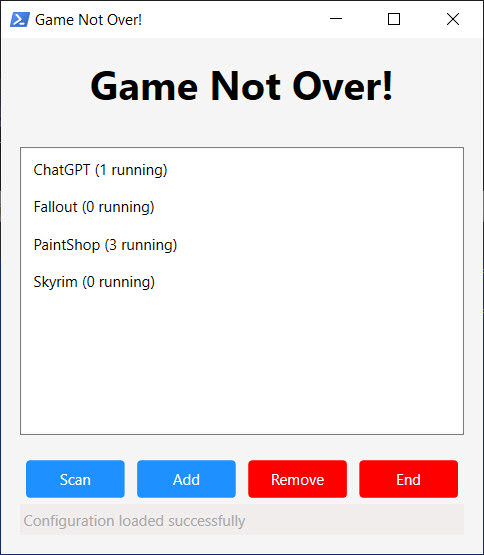

# GameNotOver
### Status: Updating Now - Here is the readme to the next version, it will be UPGRADED. For now the releases are the working but are non-GUI versions. The purpose of going back to this program, is to figure out GUI issues with a simpler program first.

### Development
- The plan is to have a GUI using WPF...
1. The WPF GUI loads without error (see pictures), now need to test featres, and bugfixing.
2. When working correctly, then make launcher self-destruct after launching, for clean operation.

### Files list...
- Package files...
```
.\GameNotOver.bat  # Entry point for user, with menu for, launcher and installer.
.\launcher.ps1  # Entry point for the main program.
.\installer.ps1  # standalone installer program.
├── scripts\  # Scripts folder.
│   ├── interface.ps1  # Interface script.
│   ├── interface.xaml  # Xaml Interface code.
│   ├── utility.ps1  # utility functions.
```
- Created by installer...
```
├── data\  # Data folder.
│   └── persistent.psd1  # Persistent configuration, created from default by installer.
```

### Description:
GameNotOver is a PowerShell application tailored for Windows users, enabling them to forcefully close all instances of selected programs through an GUI. When using programs in windows 10, upon, exiting or crashing, some programs may leave a residual 500MB-4GB, that, lock files in place or prevent loading, for example, beta or old, software, which may even cause issues, running the program again and/or shutting down the system. My application is a manageable shortlist for closing all instances of pre-selected troublesome programs of your choice, thus, saving on repeatingly, running task manager and searching for running processes, each time.

### Features:
1. Graphical User Interface - For managing the list and user interacctions, with persistence in the psd1 file in `.\data`.
2. Forceful Termination of Processes - Empowers users to forcefully close all occurrences of selected applications, effectively handling unresponsive or crashed programs.
3. Batch Launcher - For easy running of Powershell Script at the click of a button.

### Preview:
- Picture of main program (early)...
  

- The Batch Installer/Launcher...
```
========================================================================================================================
    GameNotOver - Main Menu
========================================================================================================================

    1. Launch GameNotOver

    2. Install Requirements

------------------------------------------------------------------------------------------------------------------------
Selection; Options = 1-2, Exit = X: 2
```


### Requirements:
- Windows 7-11 - The scripts are in Powershell, but its a Windows program.
- Libraries - Other than Dot Net its all built-in.
- [DotNet](https://dotnet.microsoft.com/en-us/download/dotnet/8.0) v4.5-7 - The link is for v8, its, made and tested, on that version.

### Usage:
1. Execute the batch "GameNotOver.bat" as Administrator, to launch the batch menu.
2. Select 2 to install any library requirements, this will take you to the menu after.
3. Select 1 to run the program, this runs `.\launcher.ps1`, the entry point for the main scripts.
4. ...TBA

## Notes
- None currently

## DISCLAIMER
This software is subject to the terms in License.Txt, covering usage, distribution, and modifications. For full details on your rights and obligations, refer to License.Txt.
